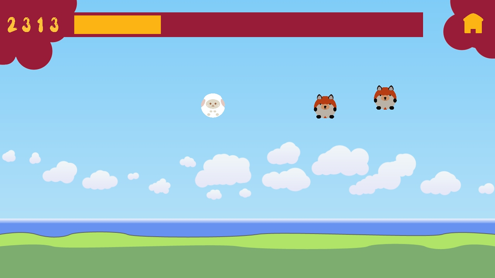

hoppy is a 2D game written for Android platform as a term project. It is written in C/C++ from scratch. Gameplay video can be found [here](  )

# Notes

* The project uses Android NDK, Revision 10e.
* As rendering backend, OpenGL ES 2 is used.
* Audio management is handled with the help of OpenSL ES.
* A simple 2D collision detection system, which offers box and circle colliders, is implemented.
* Developed for aarch64 architecture and tested on Asus Zenfone 2 Laser (ZE550KL). Timers use inline assembly written for aarch64. clock_gettime() is used for other architectures but this case is not tested.
* More technical details can be found in the [report]( https://github.com/ff-k/hoppy/blob/master/report.pdf ).
* "Brahms - Intermezzo in A major, Op.118 No.2" is used as background music.
* Textures are programmer art.
